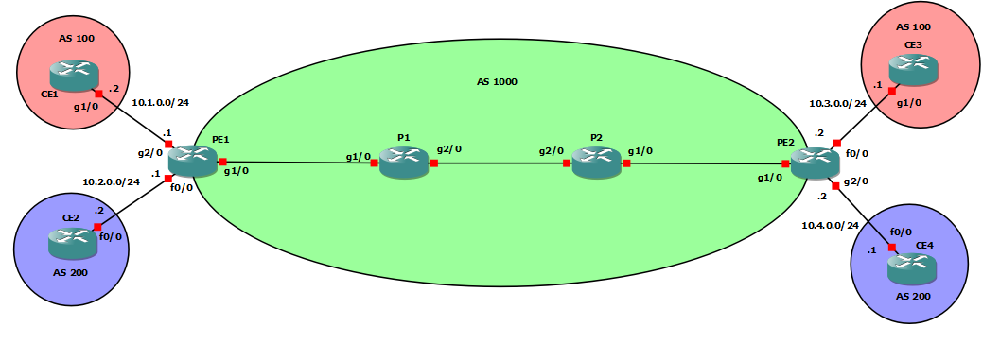

# GNS3 Project
The project consists in the deployment of a network whose scheme is shown below. We first deployed it manually in GNS3 but rapidely generated it automatically with Python scripts. The latters where implemented specifically for the project, i.e. it can't be used for any kind of network (see Usage section).

## To do list: more optionnal tasks
- [ ] Allow VPN connection between clients of different AS
- [ ] Add Internet services
- [x] Add route-reflector
- [ ] Add RSVP

## Usage
The project generates configuration for a IPv4 and OPSF network that also runs MPLS and BGP on border-routers. iBGP sessions are established between all border-routers and each of them can establish eBGP session with client border-routers. This network is capable of providing BGP/MPLS VPN solution for clients that want VPN connection between several sites.  

The command to execute main script is: `python main.py <intents.json> [project]`. An intent file MUST be given where the project name is optional. It is used with a simplier intent file (see subsection *OTHER FEATURES*). 

### To test the configuration on the given network :
1. Reproduce the network in a new GNS3 project **with the same connected interfaces** (this way you won't have to update "interface" fields in the intent file)
2. See *intents_NAS.json* file and update information: in each router section, please put after *GNS3_file* field **the complete or relative path of its corresponding directory** between double quotes.
3. Execute `python main.py intents_NAS.json`: it writes configuration files of each router in *./output/config* directory before putting it in your router directory automatically.

### To test with your own network :
1. Create your network in a new GNS3 project.
2. Write your own intent JSON file respecting the structure of the given intent file and put it in *intents_files* directory.
3. Execute `python main.py <your_intents.json>`.  

You can test the project with your own network ONLY IF you use all IPv4, OPSF and BGP/MPLS VPN eventually. The possible network changes you can make are:
- Add/delete a provider edge router PE
- Add/delete a provider router PE
- Add/delete a VPN client
- Add route-reflectors: add *route-reflector* field directly in the router section with value *true*
- Select iBGP structure: full-meshed, full-meshed only between border-routers, border-routers connected to all route-reflectors

### Other features
To simplify the intent file in respect with the project, we designed a simplier one that mainly contains descriptions of links in the network (see *intents_links.json*) and a list of file corresponding to the routers. A script will then transform it into the good format with predefined information for the specified project.  

To test this feature, simply execute `python main.py intents_links.json NAS`.  

**NOTES:**
- You can find examples of intent files in *./data/intents_file* directory: they can help you write your own intent file.

**WARNINGS:**
- DON'T DELETE any files nor directories except the *output* directory.

## More explanations
The project consist in four Python scripts that has different functions:
- *main.py*: contains main function calling functions in *config_generator.py* and *ip_generator.py* 
- *config_generator.py*: contains functions that write configuration lines in all configurations files. Each function write a section of the configuration.
- *ip_generator.py*: contains functions to create automatically needed IP adresses according to the network prefixes given in the intent file.
- *intents_util.py*: contains functions to parse intent file.
- *json_transform.py*: implement the transformation of a simplier intent file for NAS project into a complete intent file.

Although the scripts aren't designed to generate any configuration, the intent file has been written as if we could: we could update functions to generate other part of configuration without changing completely the strucutre of the intent file.

Some information are printed in terminal during execution:
- initialisation of ip matrix: you can see the subnetwork number created for each router connection
- links matrix reprensents links between routers
- final ip matrix contains all generated ip addresses with their network mask
- finally, a note that inform you generated configuration files have been moved to their directories

## Contributors
[Chijin GUI](https://github.com/ghoti-GUI), [Yanjun GE](), [Alpha KABINET CISSE](), [Sokhna DIATA BEYE](https://github.com/ssokhna) and [Camille ROBINSON](https://github.com/camileen)

## Mentions
Special mention to [INSA Lyon](https://www.insa-lyon.fr/fr) french engineering school and its (fabulous) department of Telecommunications.